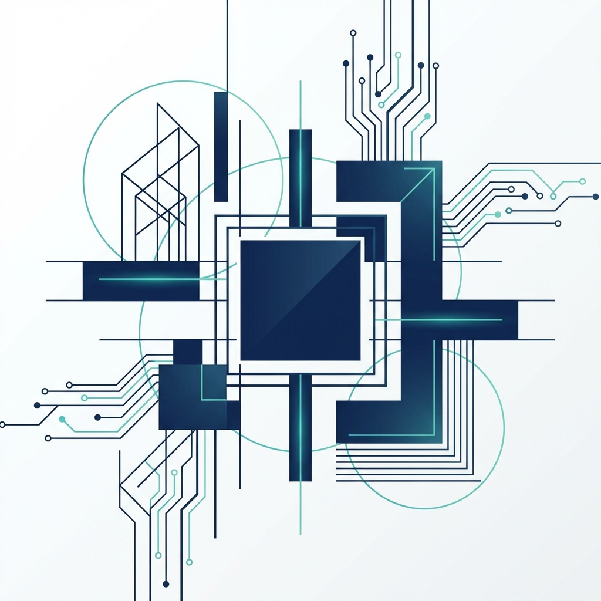

# Levec Electricidad y Construcción

Sitio web corporativo para **Levec Electricidad y Construcción**, una empresa especializada en soluciones eléctricas residenciales, comerciales e industriales, así como en proyectos de electromovilidad y certificaciones SEC.



## 📋 Descripción

Este proyecto es un sitio web estático moderno, diseñado con un enfoque minimalista y elegante. Su objetivo es presentar los servicios de la empresa de manera clara, generar confianza mediante la sección de certificaciones y facilitar el contacto con clientes potenciales.

## ✨ Características

*   **Diseño Responsivo**: Adaptado perfectamente a dispositivos móviles, tablets y escritorios.
*   **Animaciones Suaves**: Efectos de aparición (fade-in) al hacer scroll para una experiencia de usuario dinámica.
*   **Navegación Intuitiva**: Menú de navegación fijo con acceso rápido a secciones clave.
*   **Páginas de Detalle**: Páginas individuales para cada servicio (Residencial, Comercial, Industrial, Certificación, Electromovilidad).
*   **Sección de Proveedores**: Visualización de marcas certificadas con las que trabaja la empresa.
*   **Formulario de Contacto**: Sección de contacto destacada con diseño premium.

## 🛠️ Tecnologías Utilizadas

*   **HTML5**: Estructura semántica.
*   **CSS3**: Estilos personalizados, Flexbox, Grid, Variables CSS y Animaciones.
*   **JavaScript**: Lógica para el menú móvil y observadores de intersección (Intersection Observer) para animaciones.
*   **Ionicons**: Iconografía moderna y escalable.

## 🚀 Cómo Ejecutar Localmente

Para ver el proyecto en tu máquina local:

1.  Clona este repositorio:
    ```bash
    git clone https://github.com/tu-usuario/levec-electricidad.git
    ```
2.  Navega al directorio del proyecto:
    ```bash
    cd levec-electricidad
    ```
3.  Si tienes Python instalado, puedes levantar un servidor simple:
    ```bash
    python -m http.server 3000
    ```
    O si prefieres usar Node.js (npx):
    ```bash
    npx http-server -p 3000
    ```
4.  Abre tu navegador en `http://localhost:3000`.

## ☁️ Despliegue en Vercel

Este proyecto está listo para ser desplegado en Vercel.

1.  Sube tu código a GitHub.
2.  Crea una cuenta en [Vercel](https://vercel.com/signup).
3.  Importa tu repositorio de GitHub.
4.  Vercel detectará automáticamente la configuración. ¡Listo!

[](https://vercel.com/new/clone?repository-url=https%3A%2F%2Fgithub.com%2Ftu-usuario%2Flevec-electricidad)

## 📄 Estructura del Proyecto

```
levec-electricidad/
├── assets/          # Imágenes y recursos estáticos
├── css/
│   └── style.css    # Hoja de estilos principal
├── js/
│   └── script.js    # Lógica JavaScript (menú, scroll)
├── servicios/       # Páginas de detalle de servicios
│   ├── residencial.html
│   ├── comercial.html
│   ├── ...
└── index.html       # Página principal
```

## 📞 Contacto

*   **Teléfono**: +56 9 4420 4060
*   **Email**: contacto@levec.cl

---
© 2024 Levec Electricidad y Construcción. Todos los derechos reservados.
